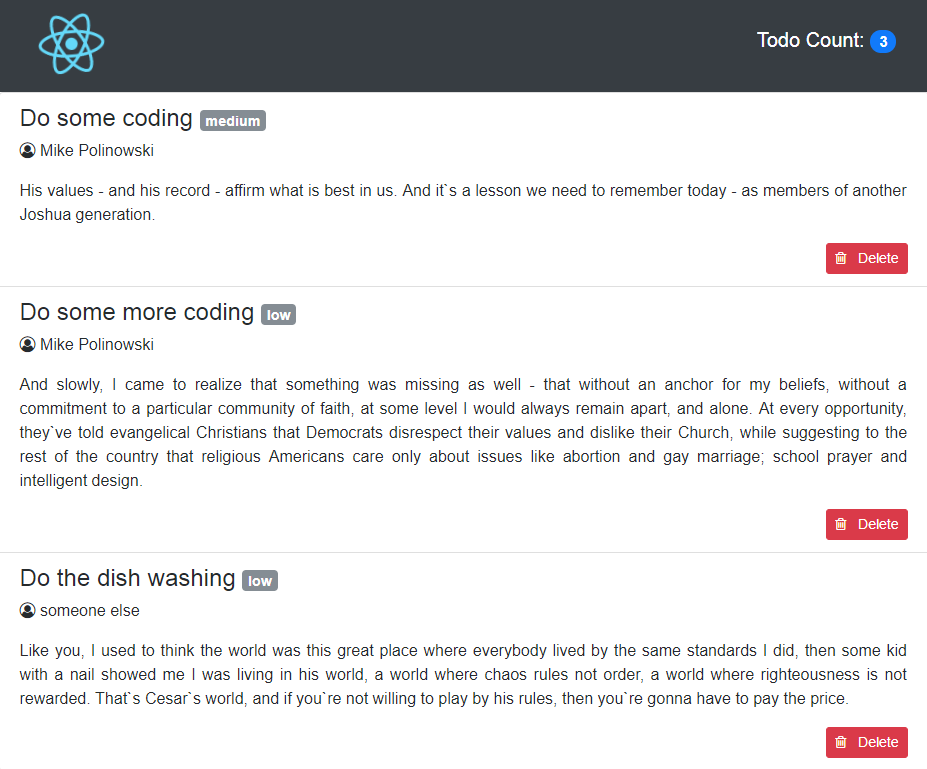

# React-TODO-List
Every web-dev should have one or two of them on Github ~

01. [create-react-app](#01-create-react-app)
02. [Set Initial State](#02-set-initial-state)
03. [JSX, Font-Awesome and Bootstrap](#03-jsx,-font-awesome-and-bootstrap)
04. [Add Remove TODO function](#04-add-remove-todo-function)
0. [](#0-)
0. [](#0-)
0. [](#0-)
0. [](#0-)


## 01 create-react-app
n the following tutorial we’ll use create-react-app to bootstrap our application. It’s an opinionated zero-configuration starter kit for React introduced by Facebook in 2016. We can install create-react-app by using npm:

```
npm install -g create-react-app
```

Having completed the installation successfully we're able to use create-react-app to initiate a new React project:

```
create-react-app obligatory-react-todo-list-2017
```

 This creates a new initial React project in the folder obligatory-react-todo-list-2017. Dependencies are installed automatically. Change into the folder and start the app with **npm start** on *localhost:3000*.


## 02 Set Initial State

Now open the file ./src/App.js inside your code editor and add some Todo's right below the import statements (delete the <App /> component, that was created below):

```js
// add initial data model array
var todos = [
  {
    todoTitle: 'Do some coding',
    todoResponsible: 'Me',
    todoDescription: 'Todo description',
    todoPriority: 'medium'
  },
  {
    todoTitle: 'Drink Coffee',
    todoResponsible: 'Me',
    todoDescription: 'Todo description',
    todoPriority: 'high'
  },
  {
    todoTitle: 'Do some more coding',
    todoResponsible: 'Me',
    todoDescription: 'Todo description',
    todoPriority: 'low'
  }
]
```

Now add the todos array to the state of app component. This is done by introducing a class constructor where we can set the initial component state like you can see in the following:

```js
class App extends Component {

  // set initial component state to todos array
  constructor(props) {
    super(props);
    this.state = {
      todos
    };
  }
 [...]
 }
```


## 03 JSX, Font-Awesome and Bootstrap

We want to use Bootstrap CSS for our rendered app, which we include via CDN links (see [getbootstrap.com](http://getbootstrap.com/)) inside the public/index.html page.

```html
<head>
  <link rel="stylesheet" href="https://maxcdn.bootstrapcdn.com/bootstrap/4.0.0-beta/css/bootstrap.min.css" integrity="sha384-/Y6pD6FV/Vv2HJnA6t+vslU6fwYXjCFtcEpHbNJ0lyAFsXTsjBbfaDjzALeQsN6M" crossorigin="anonymous">
</head>

<body>
  <script src="https://code.jquery.com/jquery-3.2.1.slim.min.js" integrity="sha384-KJ3o2DKtIkvYIK3UENzmM7KCkRr/rE9/Qpg6aAZGJwFDMVNA/GpGFF93hXpG5KkN" crossorigin="anonymous"></script>
  <script src="https://cdnjs.cloudflare.com/ajax/libs/popper.js/1.11.0/umd/popper.min.js" integrity="sha384-b/U6ypiBEHpOf/4+1nzFpr53nxSS+GLCkfwBdFNTxtclqqenISfwAzpKaMNFNmj4" crossorigin="anonymous"></script>
  <script src="https://maxcdn.bootstrapcdn.com/bootstrap/4.0.0-beta/js/bootstrap.min.js" integrity="sha384-h0AbiXch4ZDo7tp9hKZ4TsHbi047NrKGLO3SEJAg45jXxnGIfYzk4Si90RDIqNm1" crossorigin="anonymous"></script>
</body>
```

Now we can use bootstrap classNames directly inside the render statement of our <App /> component in src/app.js.

For Font Awesome, we download the zip archive from [fontawesome.io](http://fontawesome.io) and copy only the \*.css and web-font files to src/fonts. All web-font files are referenced inside font-awesome.css - the relative path has to be changed from ../fonts/[filename] to ./[filename]! Font-Awesome can now be added to our JSX code inside the render method - but remember to change class to className!

```html
<i className="fa fa-user-circle-o" aria-hidden="true"></i>
```

Our render function now looks like this, giving us a beautiful Bootstrap UI with some Font-Awesome goodness:

```js
render() {
  return (
    <div className="container">

        <nav className="navbar sticky-top navbar-dark bg-dark">
          
          <h4 className="navbar-brand">
            Todo Count: <span className="badge badge-pill badge-primary">{this.state.todos.length}</span>
          </h4>
        </nav>

        <div className="row">
          <div className="col">
            <ul className="list-group">
              { this.state.todos.map((todo, index) =>
                  <li className="list-group-item" key={index}>
                    <h4 className="list-group-item-heading">{todo.todoTitle} <small><span className="badge badge-secondary">{todo.todoPriority}</span></small></h4>
                    <p><i className="fa fa-user-circle-o" aria-hidden="true"></i> {todo.todoResponsible}</p>
                    <p className="text-justify">{todo.todoDescription}</p>
                    <button className="btn btn-danger btn-sm float-right" onClick={this.handleRemoveTodo.bind(this, index)}><span><i className="fa fa-trash-o" aria-hidden="true"></i></span>&nbsp;&nbsp; Delete</button>
                  </li>
              )}
            </ul>
          </div>
      </div>
    </div>
  );
}
```

The app should automatically reload inside of your browser and display the basic bootstrap layout of our app, using the data from the todos-array.





## 04 Add Remove TODO function

Now we want to add a Delete function to the Delete button we added above. We do this, by adding an onClick event handler to the button:

```html
<button className="btn btn-danger btn-sm float-right" onClick={this.handleRemoveTodo.bind(this, index)}>
  <span>
    <i className="fa fa-trash-o" aria-hidden="true"></i>
  </span>&nbsp;&nbsp; Delete</button>
```

Then we have to define the handleRemoveTodo function inside src/App.js above the render method:

```js
handleRemoveTodo(index) {
  this.setState({
    todos: this.state.todos.filter(function(e, i) {
      return i !== index;
    })
  })
}
```


.
